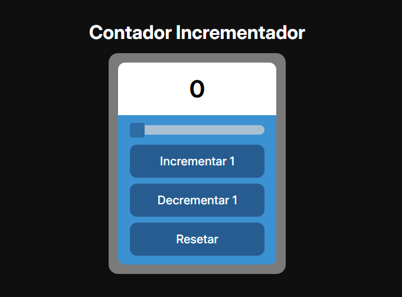

# Desafio - Contador Incrementador

## Funcionalidades
- ```Slider de personalização:``` De acordo com o número escolhido no slider, os valores de incremento e decremento irão mudar.

- ```Botão de incrementar:``` Botão que aumenta a quantidade no visor com base no valor fornecido no slider.

- ```Botão de decrementar:``` Botão que diminui a quantidade no visor com base no valor fornecido no slider.

- ```Botão de resetar:``` Botão que reinicia o contador para 0.

## <a href="https://mats057.github.io/desafio-linktou/">Clique aqui para ver o Deploy</a>
<a href="https://mats057.github.io/desafio-linktou/"></a>
